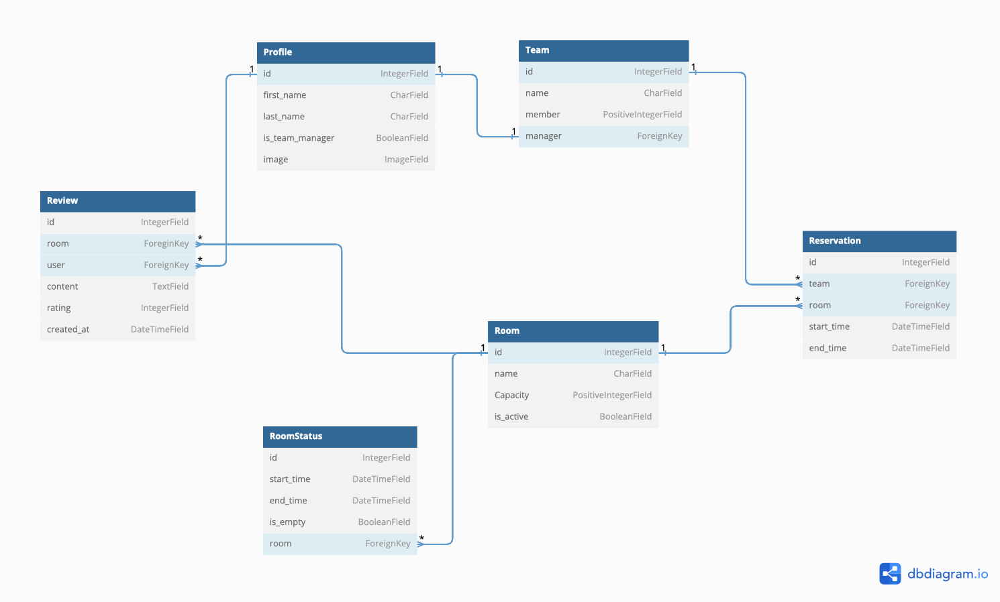

# سامانه رزرو اتاق جلسات (CRRS)

## مقدمه

این پروژه یک سامانه رزرو اتاق جلسات برای شرکت‌ها است که با استفاده از چارچوب کاری جنگو پیاده‌سازی شده است. این سامانه به کاربران امکان می‌دهد تا اتاق‌های جلسات موجود در شرکت خود را مشاهده و برای زمان مورد نظر خود رزرو کنند.

## ویژگی ها

1. **ثبت‌نام و ورود کاربران:** کاربران می‌توانند ثبت‌نام کنند و وارد حساب کاربری خود شوند

2. **پروفایل کاربری**: هر کاربر دارای یک پروفایل شخصی است که شامل اطلاعاتی نظیر نام و نام خانوادگی، تصویر و ... می‌باشد.
3. **مدیریت دسترسی**: امکان ایجاد گروه‌های مختلف برای مدیریت دسترسی کاربران وجود دارد. برای مثال، برخی از گروه‌ها ممکن است اجازه رزرو اتاق را نداشته باشند.

4. **نمایش اتاق‌های جلسات فعال**: اتاق‌های جلسات فعال در سیستم به کاربران نمایش داده می‌شود.

5. **نمایش وضعیت اتاق‌ها**: وضعیت خالی/پر بودن اتاق‌های جلسات در ساعات مختلف روز به کاربران نمایش داده می‌شود.

6. **رزرو اتاق‌ها**: کاربران می‌توانند اتاق‌های جلسات را برای زمان مورد نظر خود رزرو کنند.

7. **نظرات و امتیازها**: امکان افزودن نظرات و امتیازها برای جلسات و اتاق‌ها برای کاربران وجود دارد.
8. **مدیریت کاربران**: امکان افزودن نقش به کاربران (عادی و مدیر) و وجود سطح دسترسی مدیر برای انجام کارهای مدیریتی مانند پاک کردن یک رزرو وجود دارد.

9. **ارسال ایمیل یادآوری**: سامانه قادر است به شرکت‌کنندگان در یک جلسه ایمیل یادآوری ارسال کند.
## نکات تکمیلی

- فرآیند ورود کاربران همراه با استفاده از OTP (One-Time Password) از طریق ایمیل یا تلفن همراه انجام می‌شود.

## دیاگرام (ERD)

## توسعه دهندگان

- Mahdi Salimi
- Mohadese Hakimi
- Pooya Soleymani Nejad
- Afshin Taher Ojarod

